# Praktikum Git & GitHub

## Deskripsi Project

Project ini dibuat untuk memenuhi tugas mata kuliah Praktikum Pemrograman Web 1. Pada Project ini berisi website sederhana untuk latihan penggunaan Git dan GitHub seperti membuat repository, branching, commit, merge, pull request, merge conflict, interactive rebase, branch protection rule, dan release management.

## Struktur Project
1. index.html → halaman web sederhana
2. .gitignore → file untuk mengabaikan file tertentu
3. README.md → dokumentasi project
4. branch-protection.png → screenshot branch protection rule
5. gitlog.png → screenshot git log
6. screenshot-website.png → screenshot tampilan website
7. Screenshot proses pengerjaan tugas

## Cara Menjalankan Project

1. Clone Repository
Buka terminal atau Git Bash kemudian jalankan:

git clone https://github.com/lrsnaailaa/praktikumm-git-566025.git

Perintah tersebut digunakan untuk menyalin repository dari GitHub ke komputer lokal.

2. Masuk ke Folder Project
cd praktikumm-git-566025

Perintah tersebut digunakan untuk masuk ke folder project.

3. Buka Project di VS Code
Kemudian jalankan perintah

```bash
code .
```

Perintah tersebut digunakan untuk membuka project menggunakan Visual Studio Code.

Ada 2 cara sebenarnya, jika perintah code . tidak bisa digunakan, bisa dilakukan dengan membuka VS Code secara manual kemudian pilih:
- File
- Open Folder
- Pilih folder project

4. Menjalankan Website
Ada 2 cara untuk menjalankan website, diantaranya:

Cara 1 — Menggunakan Browser
- buka folder project
- klik 2x file index.html

Website akan langsung terbuka di browser.

Cara 2 — Menggunakan Live Server 
- install extension Live Server di VS Code
- klik kanan pada file index.html
- Kemudian pilih: Open with Live Server

Website akan berjalan otomatis di browser dan akan auto refresh ketika file diubah.

## Fitur Website
- Navigation bar
- Footer informasi kontak
- Dark mode sederhana
- Styling dasar menggunakan CSS

## Dokumentasi Pengerjaan Git & GitHub

### Tugas 1 (Inisialisasi & Commit History)

#### 1. Membuat Repository

Repository dibuat di GitHub dengan mode public agar dapat digunakan untuk praktikum Git & GitHub.

Langkah-langkah Membuat Repository
- Masuk ke halaman utama GitHub.
- Klik menu Repositories kemudian pilih New Repository.
- Isi nama repository pada bagian Repository name.
- Pilih visibility menjadi Public.
- Centang opsi Add a README file agar repository langsung memiliki file README.

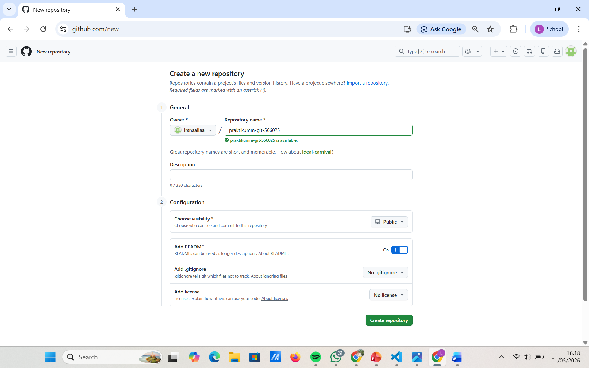

- Setelah semua pengaturan selesai, klik Create Repository.
- Repository berhasil dibuat dan akan menampilkan halaman utama repository seperti gambar berikut:

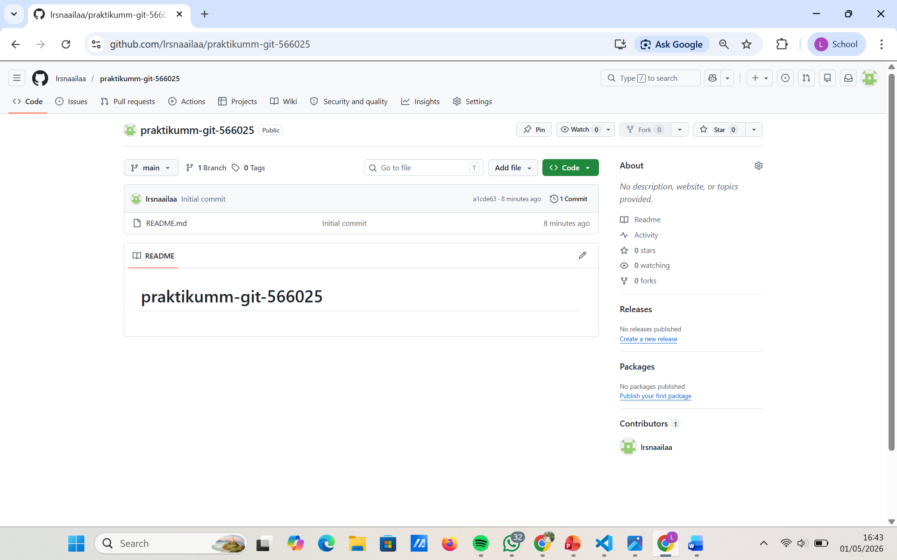

#### 2. Clone Repository

Copy link repo, kemudian buka terminal/CMD dan ketikkan : git clone https://github.com/lrsnaailaa/praktikumm-git-566025.git

Kemudian masuk ke folder dengan mengetikkan : cd praktikumm-git-566025 

Kemudian ketikkan perintah : .code dan akan diarahkan menuju halaman visual studio code. 

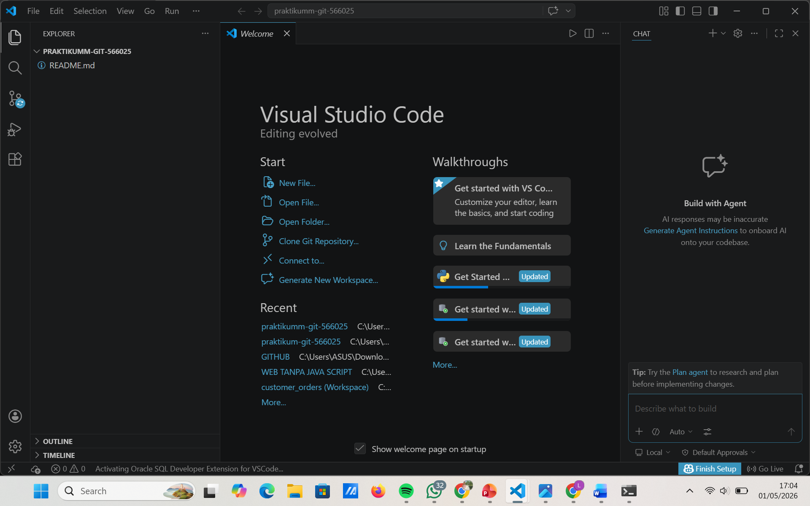

Setelah itu buat halaman website sederhana. Bisa dilihat pada gambar dibawah sudah ada kode html sederhana. 

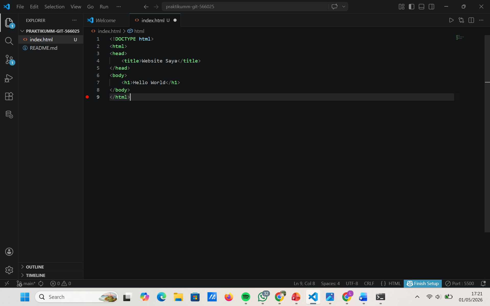

##### Commit 1

Pada tahap ini, dilakukan perubahan pada file HTML dengan menambahkan elemen header dan paragraf.

Kode yang ditambahkan adalah sebagai berikut:

```html
<h1>Halo, Selamat Datang di Website</h1>
<p>Ini adalah website sederhana untuk tugas Git & GitHub</p>
```

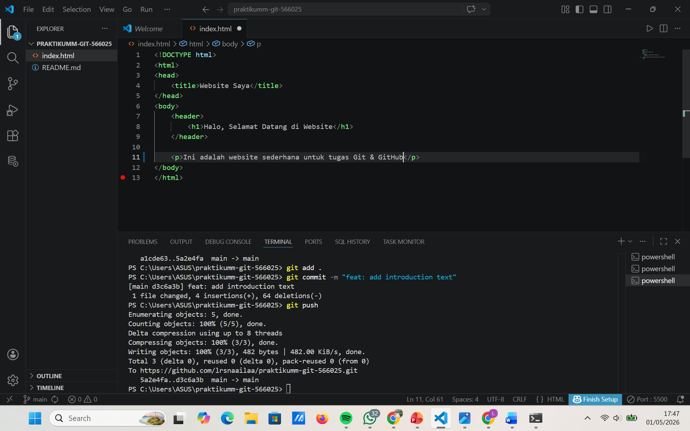

Setelah itu, file disimpan dan hasil perubahan dapat dilihat pada tampilan website seperti berikut:

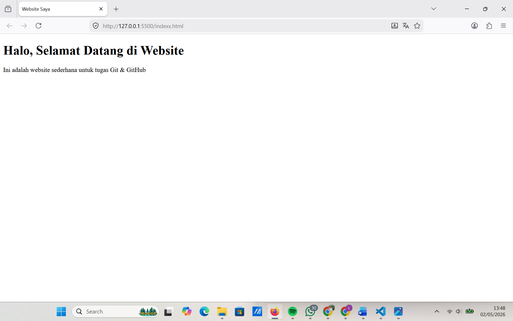

Selanjutnya, perubahan disimpan ke repository Git dengan menjalankan perintah berikut di terminal Visual Studio Code secara berurutan:

```bash
git add .
git git commit -m "feat: add header and introduction text"
git push origin main
```

Perintah tersebut digunakan untuk menambahkan file ke staging area, membuat commit dengan pesan perubahan, dan mengirimkan perubahan ke repository GitHub.

##### Commit 2

Pada tahap ini, dilakukan perubahan pada file HTML dengan mengubah paragraf.

Kode yang ditambahkan adalah sebagai berikut:

```html
<p>Ini adalah website sederhana untuk tugas Git & GitHub mata kuliah pemrograman komputer</p>
```

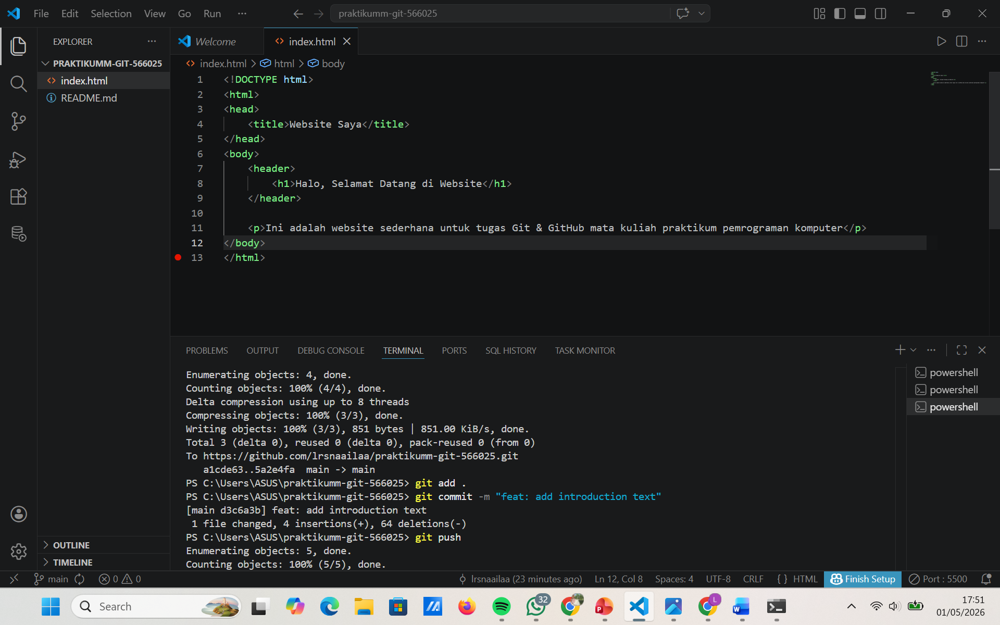

Setelah itu, file disimpan dan hasil perubahan dapat dilihat pada tampilan website seperti berikut:

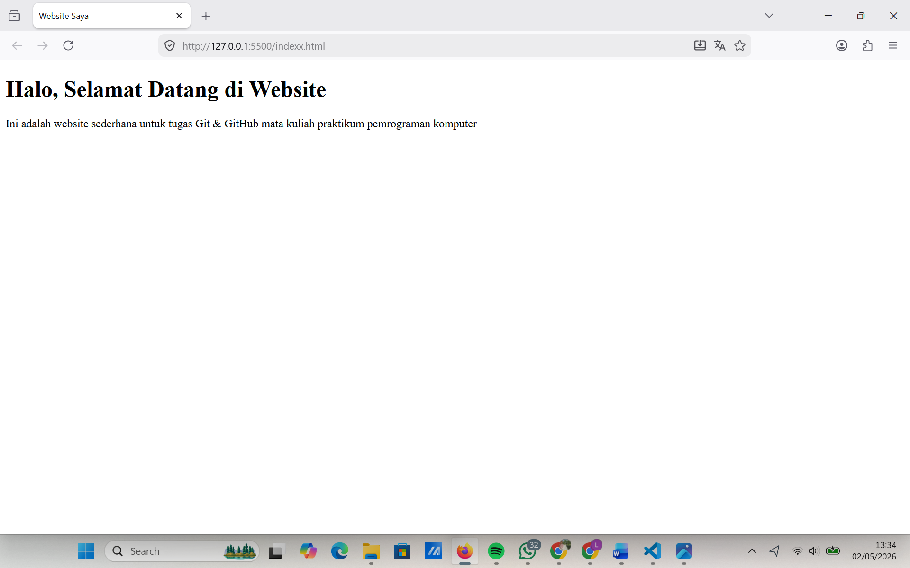

Selanjutnya, perubahan disimpan ke repository Git dengan menjalankan perintah berikut di terminal Visual Studio Code secara berurutan:

```bash
git add .
git commit -m "feat: add introduction text"
git push
```

Perintah tersebut digunakan untuk menambahkan file ke staging area, menyimpan perubahan dengan pesan commit, dan mengirimkan perubahan ke repository GitHub pada branch main.

##### Commit 3

Pada tahap ini, dilakukan perubahan pada file HTML dengan menambahkan style css sederhana.

Kode yang ditambahkan adalah sebagai berikut:

```html
<style>
        body {
            background-color: lightblue;
            text-align: center;
        }
    </style>
```

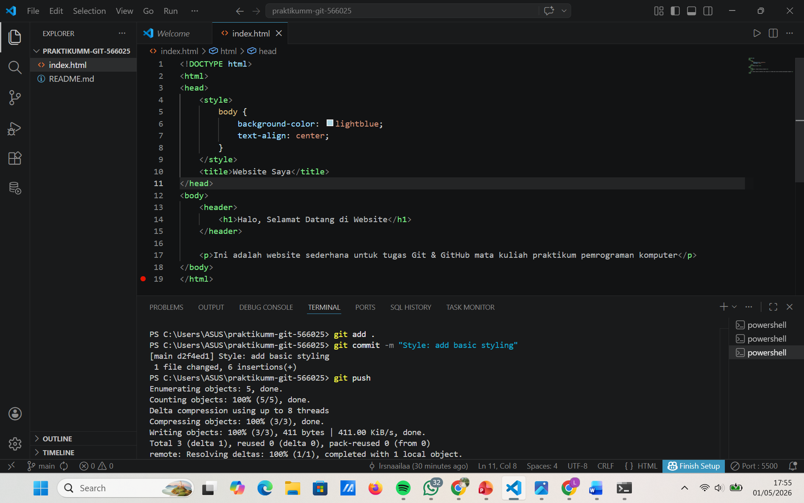

Setelah itu, file disimpan dan hasil perubahan dapat dilihat pada tampilan website seperti berikut:

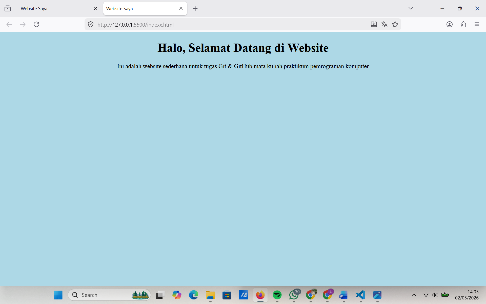

Selanjutnya, perubahan disimpan ke repository Git dengan menjalankan perintah berikut di terminal Visual Studio Code secara berurutan:

```bash
git add .
git commit -m "Style: add basic styling"
git push
```

Perintah tersebut digunakan untuk menambahkan file ke staging area, menyimpan perubahan dengan pesan commit, dan mengirimkan perubahan ke repository GitHub pada branch main.

##### Commit 4

Pada tahap ini, dilakukan perubahan pada file HTML dengan menambahkan paragraf dan button.

Kode yang ditambahkan adalah sebagai berikut:

```html
<p>Belajar Git jadi lebih seru</p>
    <button>Klik Saya</button>
```

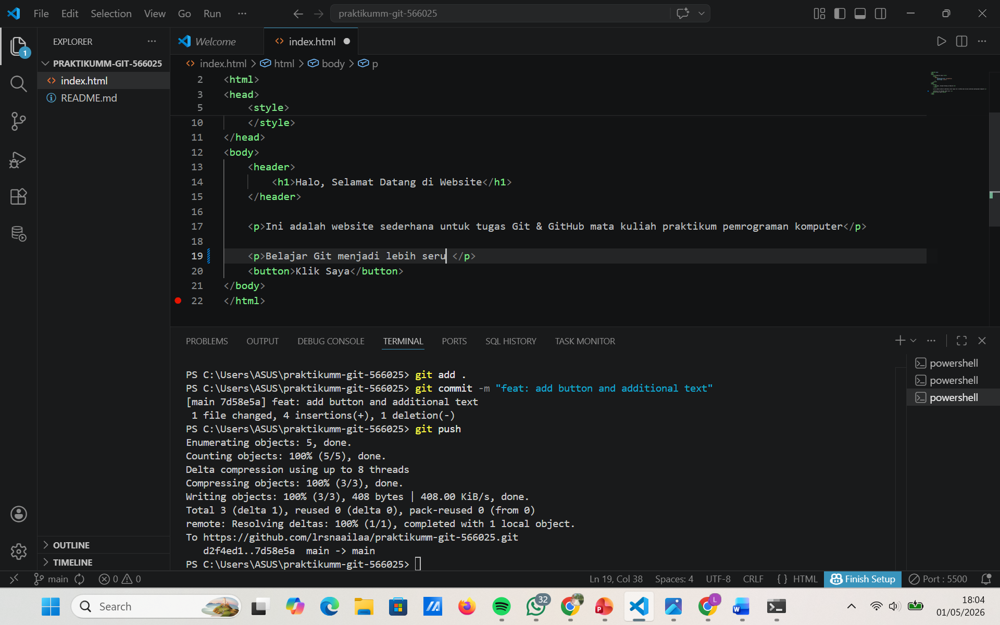

Setelah itu, file disimpan dan hasil perubahan dapat dilihat pada tampilan website seperti berikut:

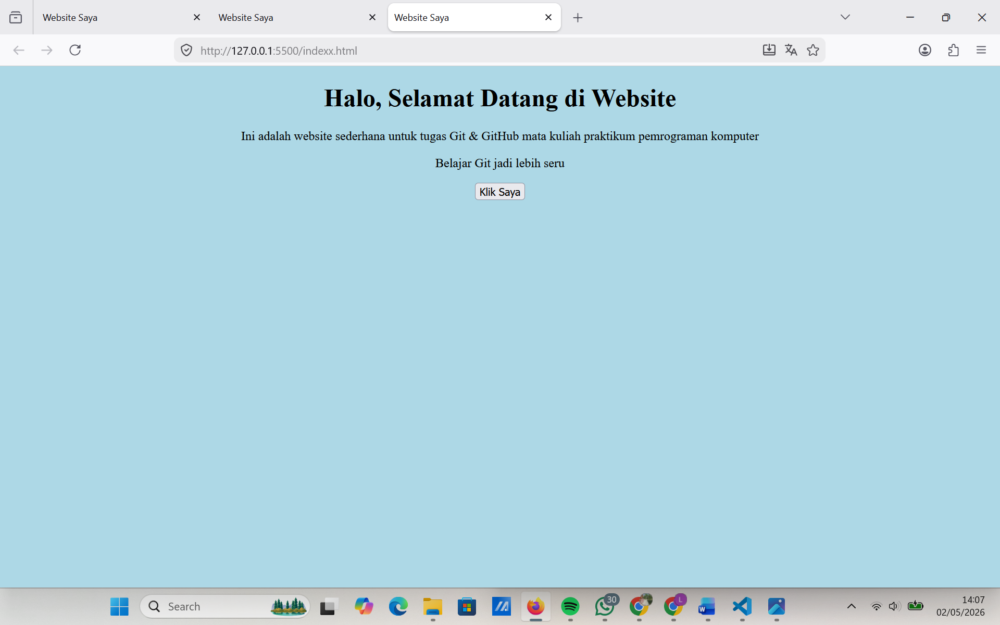

Selanjutnya, perubahan disimpan ke repository Git dengan menjalankan perintah berikut di terminal Visual Studio Code secara berurutan:

```bash
git add .
git commit -m "feat: add button and additional text"
git push
```

Perintah tersebut digunakan untuk menambahkan file ke staging area, menyimpan perubahan dengan pesan commit, dan mengirimkan perubahan ke repository GitHub pada branch main.

##### Commit 5

Pada tahap ini, dilakukan perubahan pada file HTML dengan menambahkan footer.

Kode yang ditambahkan adalah sebagai berikut:

```html
<footer>
    <p>© 2026 Website Larasati N | email: larasatinailah3@gmail.com | phone: 089630885663</p>
</footer>
```

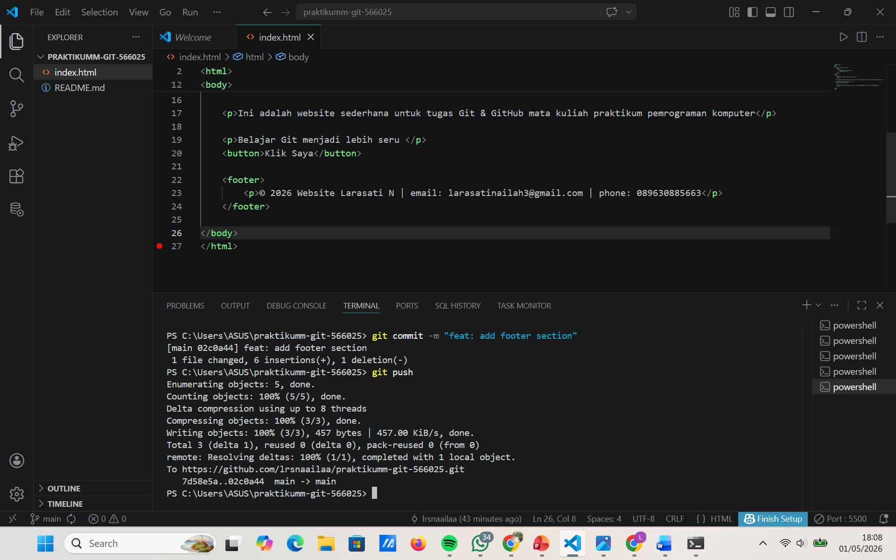

Setelah itu, file disimpan dan hasil perubahan dapat dilihat pada tampilan website seperti berikut:

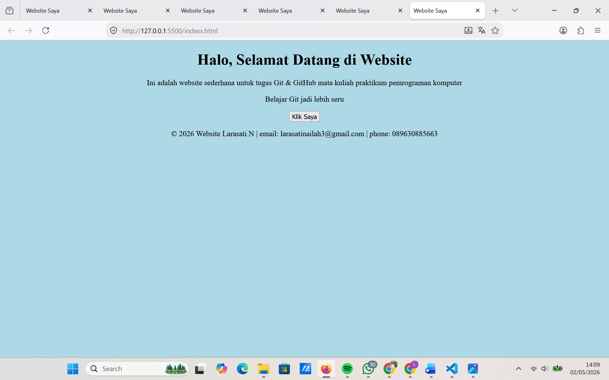

Selanjutnya, perubahan disimpan ke repository Git dengan menjalankan perintah berikut di terminal Visual Studio Code secara berurutan:

```bash
git add .
git commit -m "feat: add footer section"
git push
```

Perintah tersebut digunakan untuk menambahkan file ke staging area, menyimpan perubahan dengan pesan commit, dan mengirimkan perubahan ke repository GitHub pada branch main.

Setelah seluruh commit berhasil dibuat, dilakukan pengecekan pada repository GitHub. Hasil dari proses tersebut ditampilkan seperti pada gambar berikut:

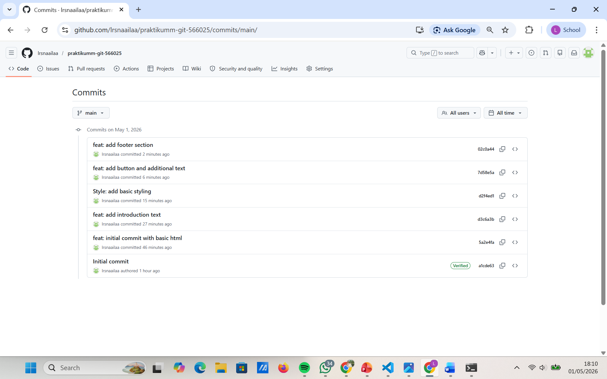

#### 3. Membuat file .gitignore

Langkah-langkah untuk membuat file `.gitignore` adalah sebagai berikut:

1. Membuat file baru pada Visual Studio Code atau di dalam folder project dengan nama `.gitignore`.

2. Mengisi file `.gitignore` dengan konfigurasi berikut:

```bash
   .DS_Store
   *.log
   node_modules/
```

3. Menyimpan (save) file yang telah dibuat.

4. Menjalankan perintah berikut pada terminal secara berurutan untuk menyimpan perubahan ke repository GitHub:

```bash
git add .gitignore
git commit -m "chore: add gitignore"
git push
```

#### 4. Menampilkan Riwayat Commit (Git Log)

Langkah pertama, jalankan perintah berikut pada terminal Visual Studio Code untuk melihat riwayat commit dalam bentuk ringkas dan graf:

```bash
git log --oneline --graph
```

Perintah tersebut akan menampilkan riwayat commit seperti pada gambar berikut:


Selanjutnya, screenshot hasil tersebut, beri nama file gitlog.png, kemudian simpan ke dalam folder project.

Setelah itu, jalankan perintah berikut secara berurutan untuk menambahkan file screenshot ke repository GitHub:

```bash
git add .
git commit -m "docs: add git log screenshot"
git push origin main
```
### Tugas 2 (Branching & Pull Request)

1. Membuat Branch

Sebelum membuat branch baru, pastikan posisi repository berada pada branch main.

Gunakan perintah berikut pada terminal:

```bash
git branch
```

Apabila output menunjukkan * main, maka posisi branch sudah benar.

#### Branch 1 (Navbar)

Buat branch baru dengan nama feature/navbar menggunakan perintah:

```bash
git checkout -b feature/navbar
```

Kemudian, bagian file index.html diubah dengan menambahkan kode navbar berikut:

```html
<nav>
    <a href="#">Home</a> |
    <a href="#">About</a> |
    <a href="#">Contact</a>
</nav>
```

Setelah selesai melakukan perubahan, perintah dibawah ini dijalankan secara berurutan:

```bash
git add .
git commit -m "feat: add navbar"
git push origin feature/navbar
```

#### Branch 2 (Footer)

Sebelum membuat branch baru, kembali terlebih dahulu ke branch main:

```bash
git checkout main
```

Kemudian buat branch baru dengan nama feature/footer:

```bash
git checkout -b feature/footer
```

Kemudian bagian footer pada file index.html diubah menjadi seperti berikut:

<footer>
    <p>© 2026 Website Saya</p>
    <p>Email: contoh@email.com</p>
</footer>

Setelah itu perintah dibawah ini dijalankan secara berurutan:

```bash
git add .
git commit -m "feat: update email in footer"
git push origin feature/footer
```

#### Branch 3

Sebelum membuat branch baru, kembali terlebih dahulu ke branch main:

```bash
git checkout main
```

Kemudian buat branch baru dengan nama hotfix/typo:

Kemudian bagian footer pada file index.html diubah menjadi seperti berikut:

```html
<h1>Halo! Selamat Datang di Website</h1> 
```

Setelah itu perintah dibawah ini dijalankan secara berurutan:

```bash
git add .
git commit -m "fix: correct typo in homepage"
git push origin hotfix/typo
```

2. Membuat Pull Request

Langkah-langkah untuk membuat Pull Request pada branch feature/navbar adalah sebagai berikut:

1. Buka repository GitHub, kemudian masuk ke tab Pull Requests dan klik New Pull Request.

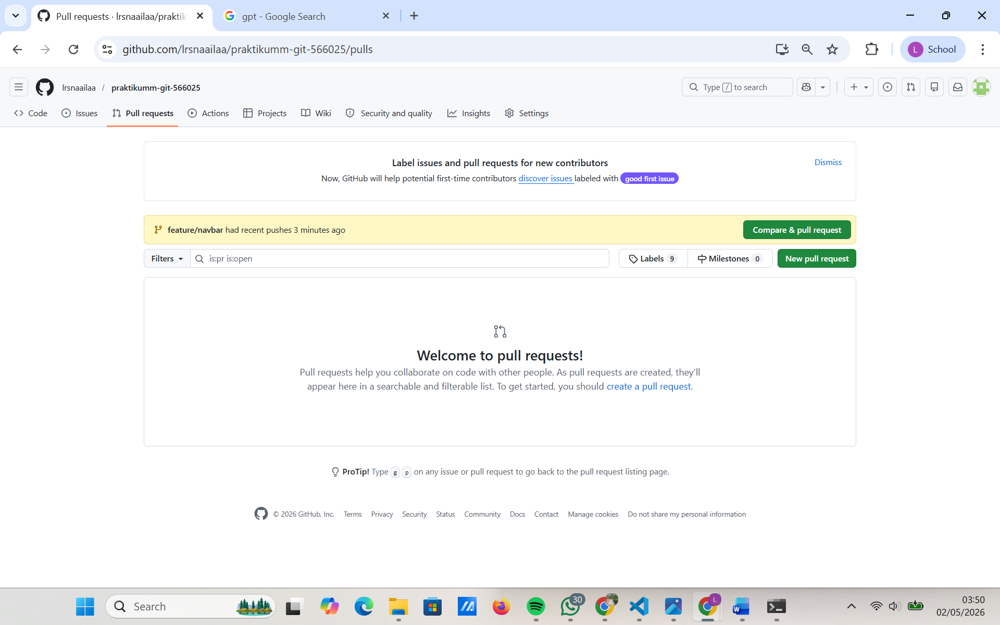

#### Pull Request 1 (Feature/Navbar)

Atur :
- base : main
- comparenya : feature/navbar. 
Setelah itu klik Create Pull Request.

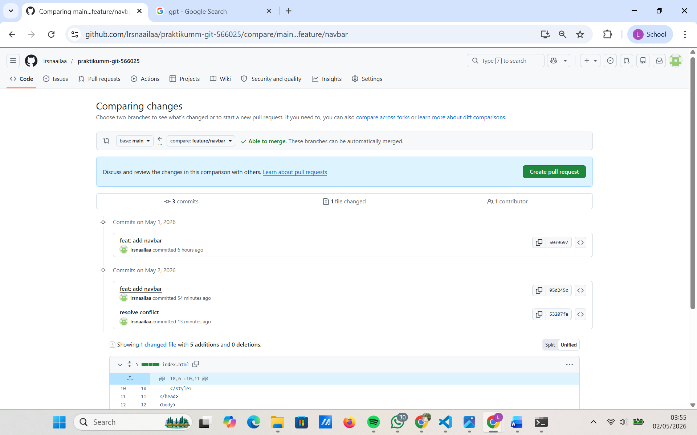

Isi bagian title dan description dan tambahkan label enhancement untuk menandai bahwa perubahan berupa penambahan fitur.

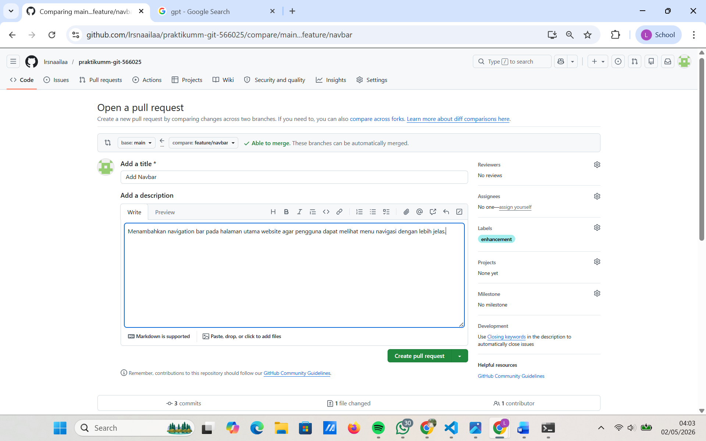

Setelah Pull Request selesai dibuat, dilakukan proses merge dengan memilih opsi Squash and Merge sesuai ketentuan penugasan.

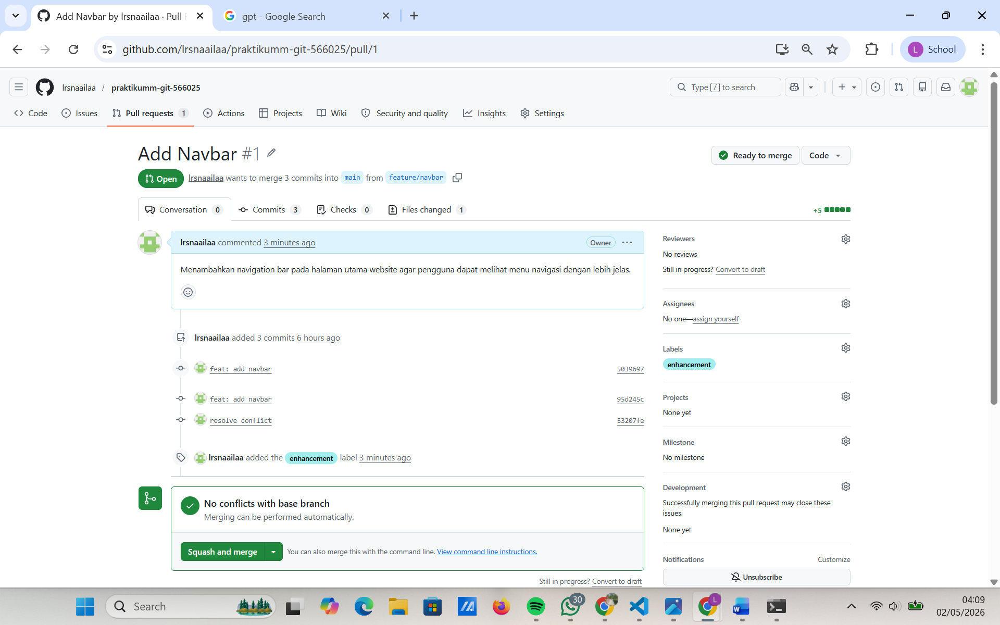

Klik Confirm Squash and Merge untuk menyelesaikan proses merge. Setelah merge berhasil dilakukan, klik Delete Branch untuk menghapus branch yang sudah tidak digunakan agar repository tetap rapi dan terorganisir dengan baik.

#### Pull Request 2 (Feature/Footer)

Atur :
- base : main
- comparenya : feature/footer.
Setelah itu klik Create Pull Request.

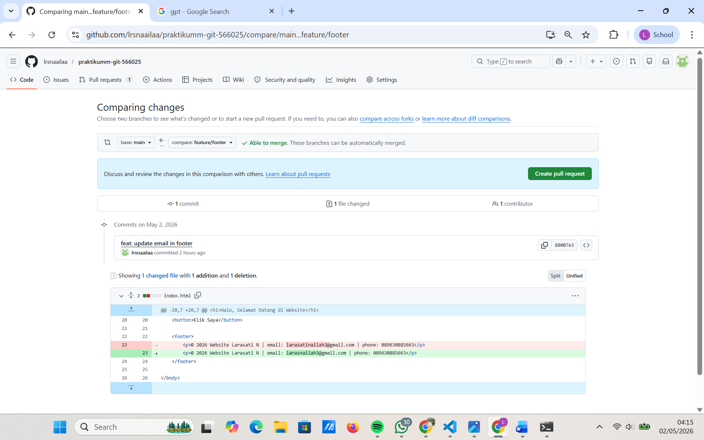

Isi bagian title dan description dan tambahkan label enhancement untuk menandai bahwa perubahan berupa penambahan fitur.

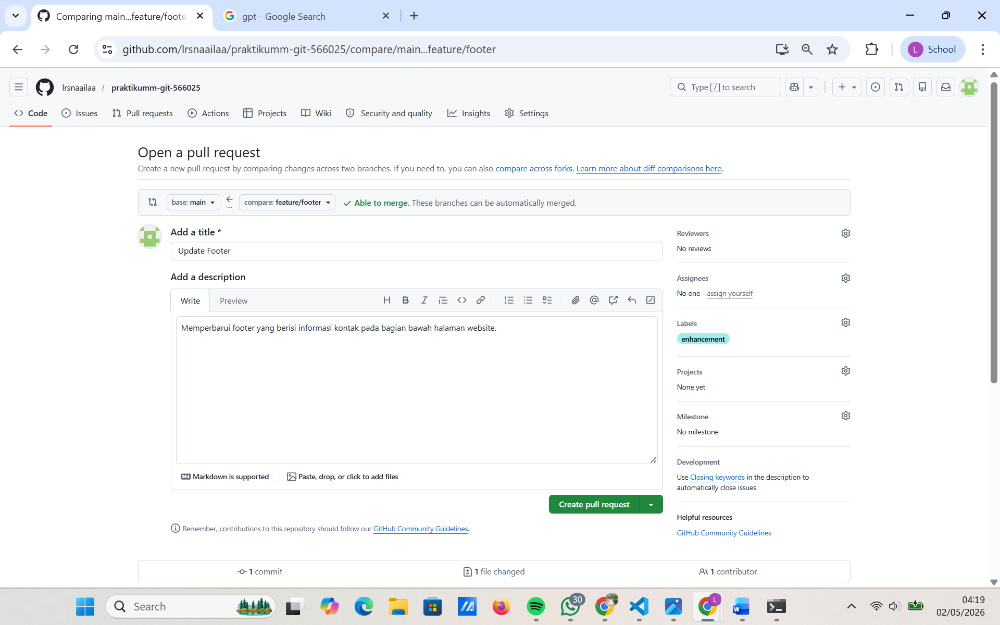

Setelah Pull Request selesai dibuat, dilakukan proses merge dengan memilih opsi Squash and Merge sesuai ketentuan penugasan.

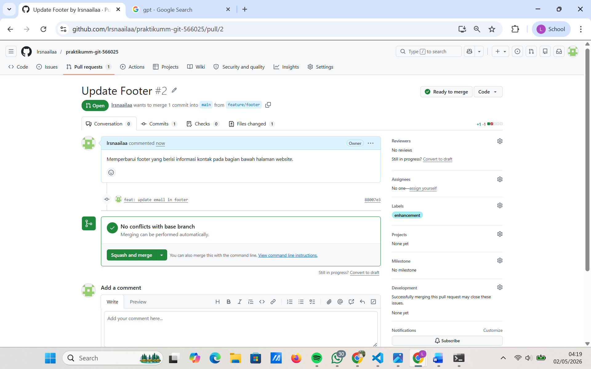

Klik Confirm Squash and Merge untuk menyelesaikan proses merge. Setelah merge berhasil dilakukan, klik Delete Branch untuk menghapus branch yang sudah tidak digunakan agar repository tetap rapi dan terorganisir dengan baik.

#### Pull Request 3 (Feature/Footer)

Atur :
- base : main
- comparenya : hotfix/typo.
Setelah itu klik Create Pull Request.

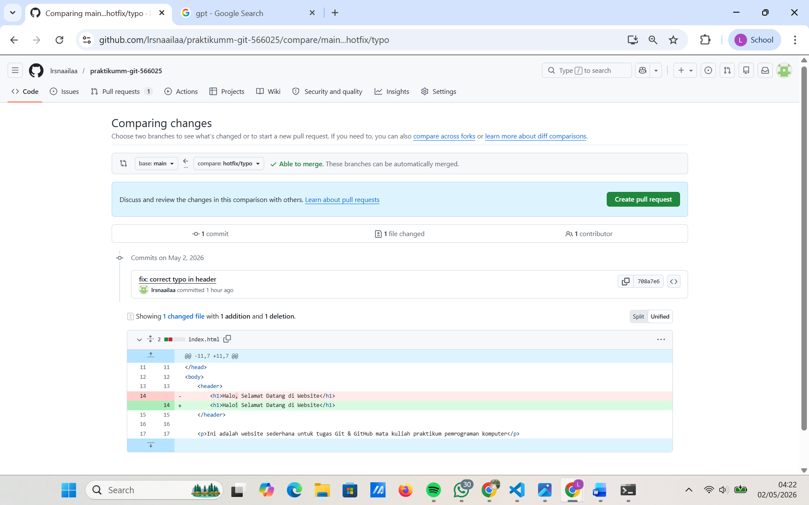

Isi bagian title dan description dan tambahkan label bug untuk menandai bahwa perubahan berupa perbaikan error / masalah.

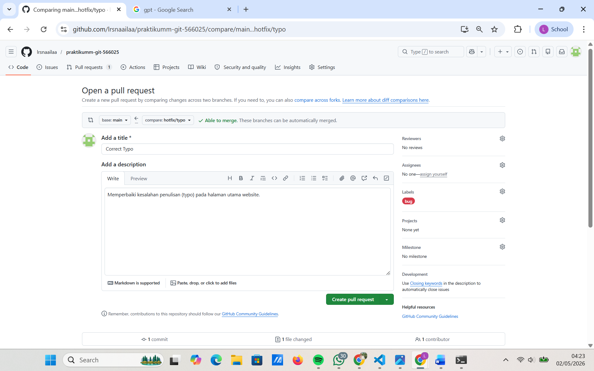

Setelah Pull Request selesai dibuat, dilakukan proses merge dengan memilih opsi Merge pull request sesuai ketentuan penugasan.

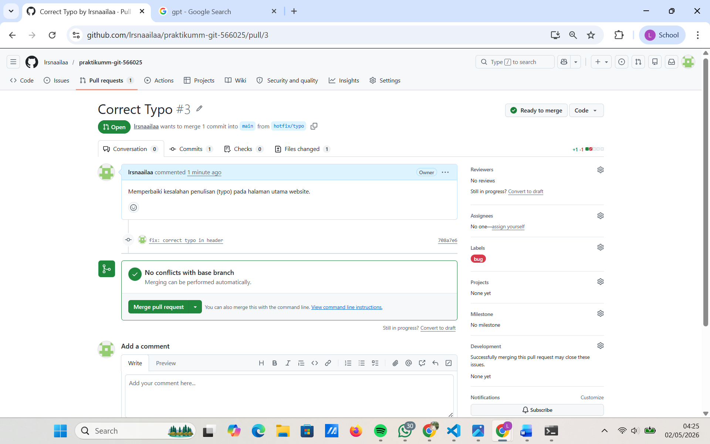

Klik Confirm Merge untuk menyelesaikan proses merge. Setelah merge berhasil dilakukan, klik Delete Branch untuk menghapus branch yang sudah tidak digunakan agar repository tetap rapi dan terorganisir dengan baik.

#### Memasang Branch Protection Rule

Branch Protection Rule digunakan untuk melindungi branch utama (main) agar perubahan tidak dapat langsung di-merge tanpa melalui proses Pull Request. Fitur ini membantu menjaga kualitas dan keamanan kode pada repository.

Langkah-langkah Memasang Branch Protection Rule adalah sebagai berikut:
- Buka repository GitHub yang digunakan untuk praktikum.
- Masuk ke tab Settings, kemudian pilih menu Branches.
- Pada bagian Branch protection rules, klik Add branch protection rule.

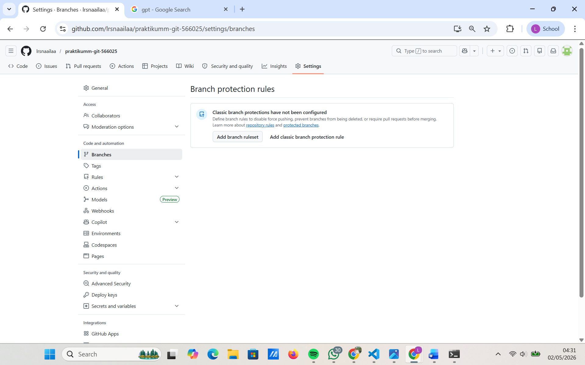

- Isi bagian Branch name pattern dengan: main
- Centang opsi : Require a pull request before merging

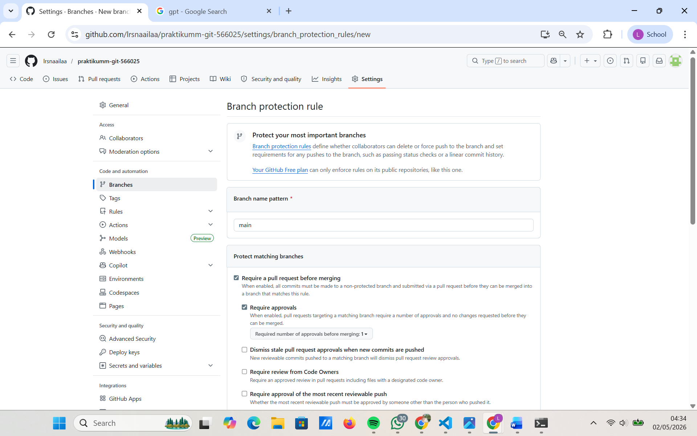

- Setelah selesai, klik Create untuk menyimpan aturan branch protection. Hasilnya akan terlihat seperti gambar dibawah ini:

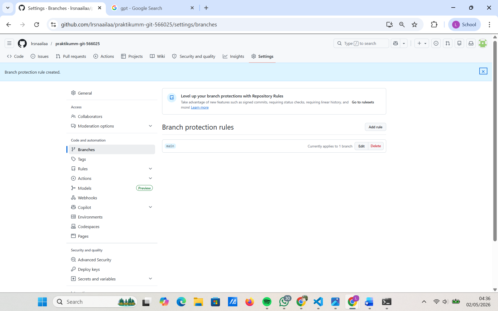

- Kemudian screenshot hasil konfigurasi Branch Protection Rule.
- Upload file screenshot tersebut ke dalam repository GitHub.
- Tambahkan gambar screenshot ke dalam file README.md menggunakan sintaks berikut:

```
## Branch Protection Rule
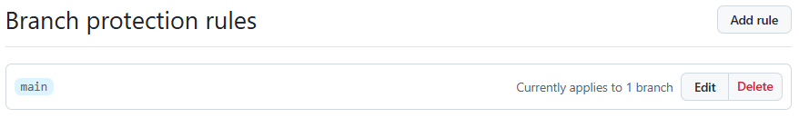
```

## Branch Protection Rule


Setelah itu perintah dibawah ini dijalankan secara berurutan:

```bash
git add .
git commit -m "docs: add branch protection screenshot"
git push origin main
```

Setelah berhasil di-push, screenshot Branch Protection Rule akan tampil pada halaman repository GitHub melalui file README.md. seperti yang terlihat pada gambar dibawah ini

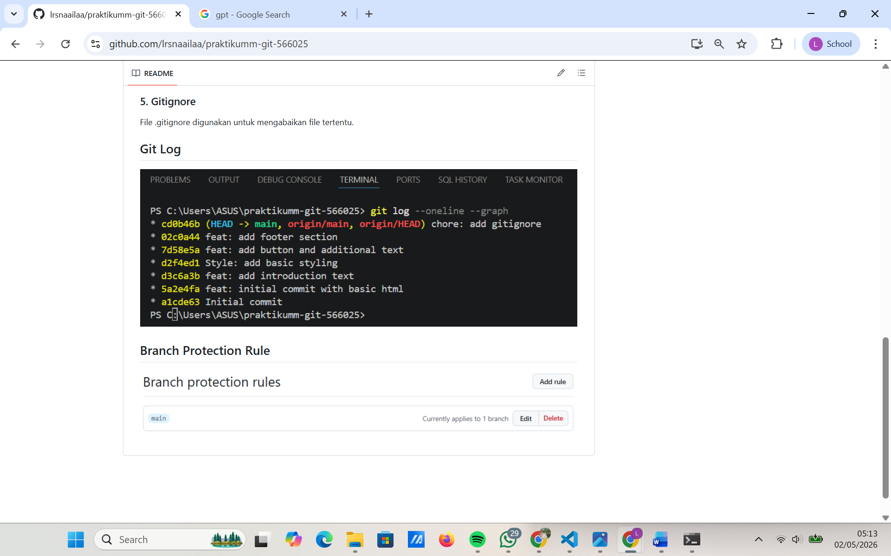

### Tugas 3 (Konflik & Rebase)

#### Simulasi Konflik (Merge Conflict)

Pada tahap ini dilakukan simulasi konflik antar branch untuk memahami cara kerja merge conflict serta proses penyelesaiannya secara manual.

Sebelum memulai simulasi konflik, pastikan repository berada pada branch main dan sudah menggunakan versi terbaru dari repository remote dengan menjalankan perintah berikut: 

```bash
git checkout main
git pull origin main
```

##### Membuat Brach experiment/color-A

Branch pertama dibuat dengan nama experiment/color-A menggunakan perintah:

```bash
git checkout -b experiment/color-A
```

Selanjutnya, buka file index.html lalu cari bagian berikut:

```html
background-color: lightblue;
```

Kemudian ubah menjadi:

```html
background-color: pink;
```

Setelah perubahan selesai dilakukan,  perintah dibawah ini dijalankan secara berurutan:

```bash
git add .
git commit -m "style: change background to pink"
git push origin experiment/color-A
```

##### Membuat Branch experiment/color-B

Setelah branch pertama selesai dibuat, kembali terlebih dahulu ke branch main, kemudian buat branch baru bernama experiment/color-B:

```bash
git checkout main
git checkout -b experiment/color-B
```

Buka kembali file index.html, kemudian cari bagian:

```html
background-color: lightblue; 
```

Ubah menjadi:

```html
background-color: yellow;
```

Setelah selesai melakukan perubahan, dilakukan commit dan push dengan perintah berikut:

```bash
git add .
git commit -m "style: change background to yellow"
git push origin experiment/color-B
```

##### Merge Branch experiment/color-A ke main

Langkah berikutnya adalah melakukan merge branch experiment/color-A ke branch main menggunakan perintah:

```bash
git checkout main
git merge experiment/color-A
git push origin main
```

##### Simulasi Konflik saat Merge experiment/color-B

Selanjutnya lakukan merge branch experiment/color-B ke branch main:

```bash
git merge experiment/color-B
```

Pada tahap ini konflik (merge conflict) akan muncul karena kedua branch mengubah bagian kode yang sama.

Ketika file index.html dibuka, akan muncul tampilan seperti berikut:

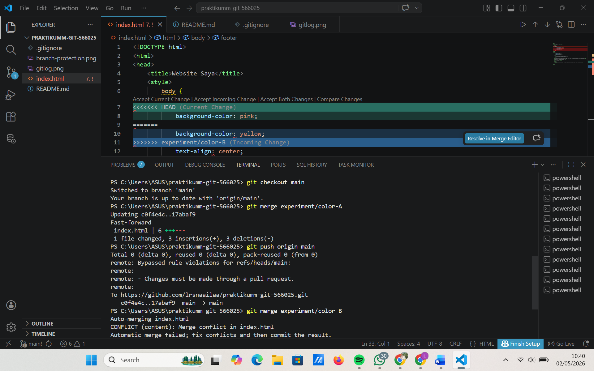

Konflik tersebut menunjukkan bahwa branch main menggunakan warna pink, sedangkan branch experiment/color-B menggunakan warna yellow.

##### Menyelesaikan Konflik secara Manual

Konflik dapat diselesaikan dengan memilih salah satu perubahan yang akan digunakan. Pada praktikum ini yang dipilih adalah warna yellow.

Penyelesaian konflik dapat dilakukan dengan:
- memilih Accept Incoming Change, atau
- menghapus simbol berikut secara manual:
    • <<<<<<
    • =======
    • >>>>>>

Hasil akhir yang digunakan:

```html
background-color: yellow;
```

Setelah konflik berhasil diselesaikan dan file disimpan, perintah berikut dijalankan secara berurutan:

```bash
git add .
git commit -m "resolve background color conflict"
git push origin main
```

Setelah proses push berhasil dilakukan, maka konflik telah berhasil diselesaikan. 

#### Interactive Rebase

Pada bagian ini dilakukan praktik interactive rebase untuk menggabungkan beberapa commit menjadi satu commit yang lebih rapi.

##### Membuat Branch feature/dark-mode

Branch baru dibuat dengan nama feature/dark-mode menggunakan perintah:

```bash
git checkout -b feature/dark-mode
```

##### Commit 1

Mengubah background menjadi warna hitam:

```html
background-color: black;
```

Kemudian dilakukan commit:

```bash
git add .
git commit -m "dark mode step 1"
```

##### Commit 2
Ditambahkan warna teks putih pada index.html

```html
color: white;
```

Kemudian dilakukan commit dengan mengetikkan perintah dibawah ini secara berurutan:

```bash
git add .
git commit -m "dark mode step 2"
```

##### Commit 3

Ditambahkan tombol dark mode pada file index.html:

```html
<br><br>
<button style="background-color: gray; color: white; padding: 10px;">
    Dark Mode
</button>
```

Kemudian dilakukan commit dengan mengetikkan perintah dibawah ini secara berurutan:

```bash
git add .
git commit -m "dark mode step 3"
```

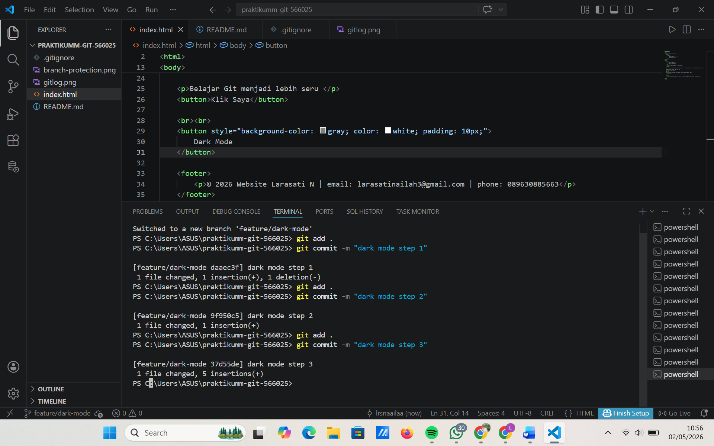

#### Mengecek Riwayat Commit

Untuk memastikan terdapat tiga commit dark mode, dijalankan perintah berikut:

```bash
git log --oneline 
```
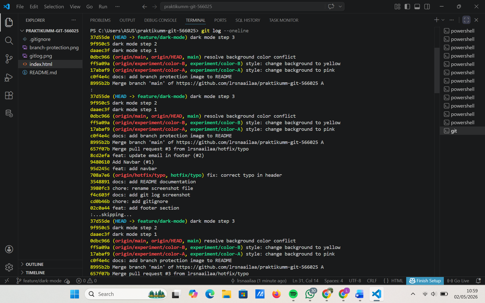
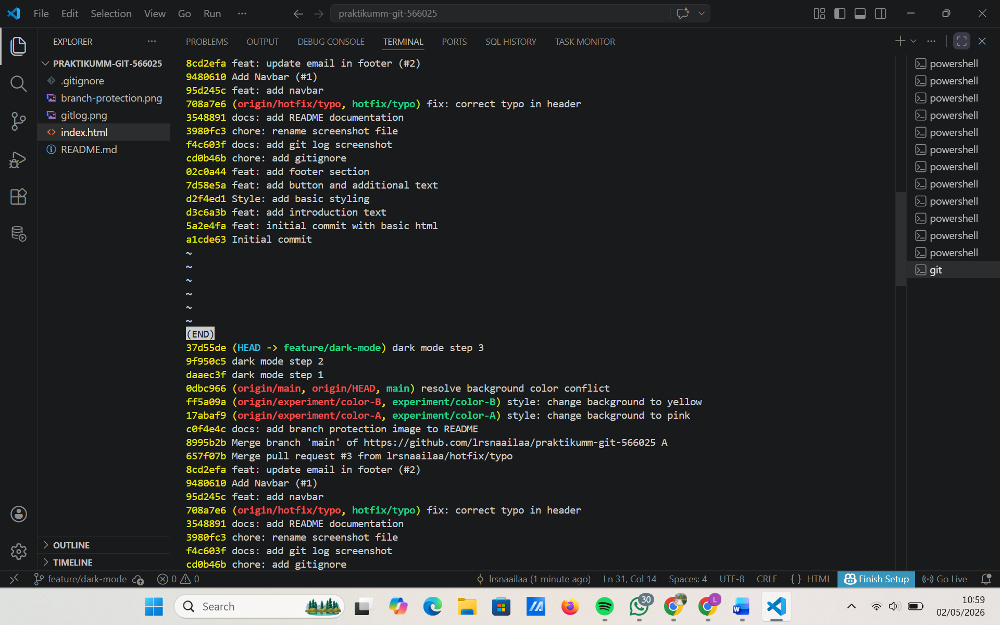
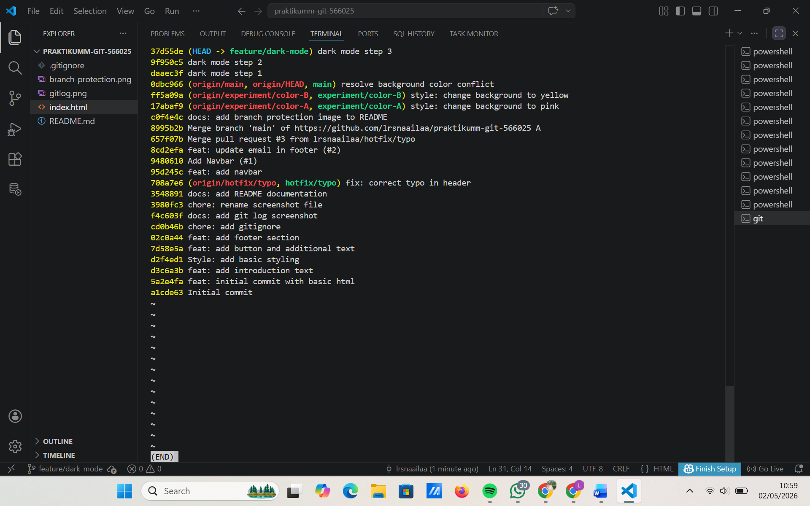

Apabila berhasil, maka akan terlihat tiga commit:
- dark mode step 1
- dark mode step 2
- dark mode step 3

#### Melakukan Interactive Rebase

Interactive rebase dilakukan untuk menggabungkan tiga commit tersebut menjadi satu commit.

Dijalankan perintah - perintah sebagai berikut:

```bash
git rebase -i HEAD~3
```

Setelah perintah tersebut dijalankan, akan muncul tampilan seperti berikut:

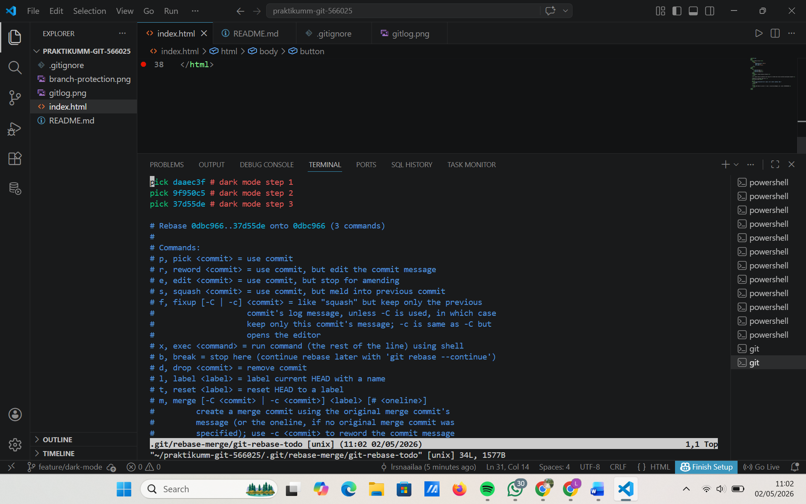

kemudian ubah tampilan

pick xxxx dark mode step 1
pick xxxx dark mode step 2
pick xxxx dark mode step 3

Menjadi:

pick xxxx dark mode step 1
squash xxxx dark mode step 2
squash xxxx dark mode step 3

Langkah pengeditan:

- Tekan tombol i pada keyboard untuk masuk ke mode edit.
- Ubah kata pick menjadi squash pada commit kedua dan ketiga.
- Tekan Esc.
- Ketik: :wq
- Tekan Enter.

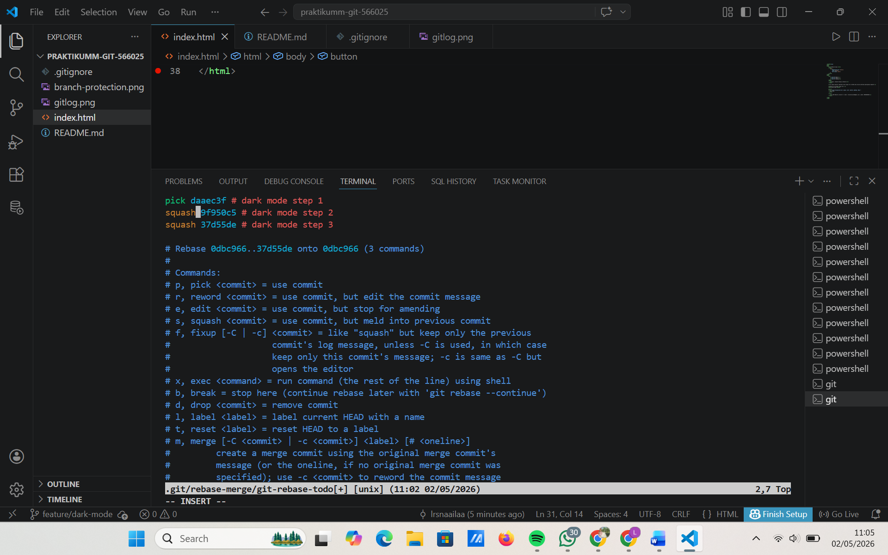

##### Mengubah Pesan Commit

Selanjutnya Git akan menampilkan editor untuk mengubah pesan commit hasil penggabungan.

Ubah menjadi:

feat: add dark mode feature

Kemudian simpan kembali dengan:
- Tekan Esc
- Ketik: :wq
- Tekan Enter

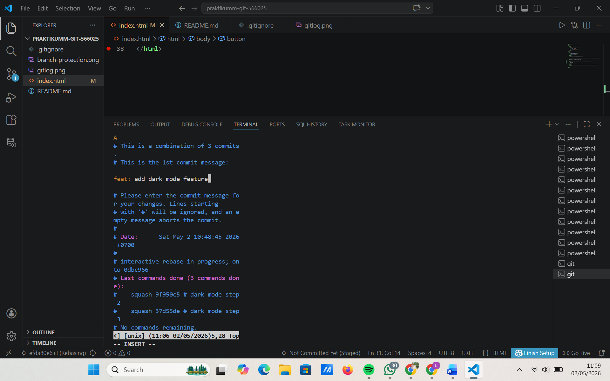

##### Mengecek Hasil Rebase

Setelah proses rebase selesai, perintah ini kembali dijalankan:

```bash
git log --oneline
```

Hasilnya, tiga commit sebelumnya telah digabung menjadi satu commit baru.

##### Push Hasil Rebase

Karena riwayat commit berubah setelah rebase, proses push harus menggunakan opsi --force:

```bash
git push origin feature/dark-mode --force
```

--force ini diperlukan karena hasil rebase mengubah histori commit pada branch tersebut.

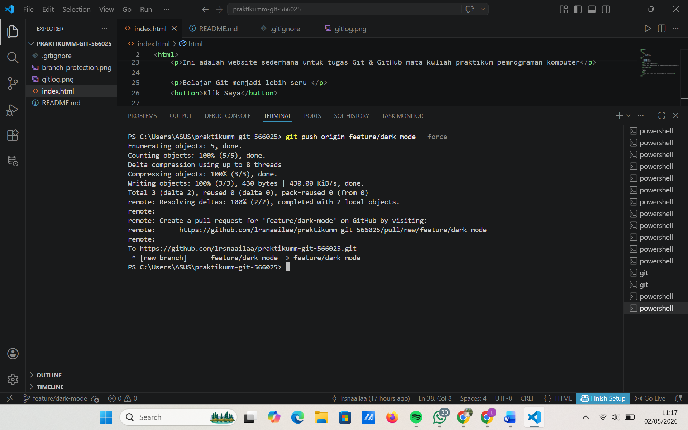

### Tugas 4

#### Screenshot Website

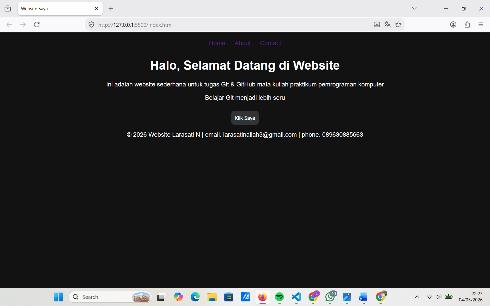

#### Dokumentasi Perintah Git

###### 1. Membuat branch baru

```bash
git checkout -b nama-branch
```

Digunakan untuk membuat dan berpindah ke branch baru.

##### 2. Menambahkan file ke staging area

```bash
git add .
```

Digunakan untuk menambahkan perubahan file sebelum commit.

##### 3. Commit perubahan

```bash
git commit -m "pesan commit"
```

Digunakan untuk menyimpan perubahan ke repository lokal.

##### 4. Push ke GitHub

```bash
git push origin nama-branch
```

Digunakan untuk mengirim branch ke GitHub.

##### 5. Pull perubahan terbaru

```bash
git pull origin main
```

Digunakan untuk mengambil update terbaru dari repository GitHub.

##### 6. Merge branch

```bash
git merge nama-branch
```

Digunakan untuk menggabungkan branch.

##### 7. Interactive rebase

```bash
git rebase -i HEAD~3
```

Digunakan untuk menggabungkan beberapa commit menjadi satu commit.

##### 8. Mengecek riwayat commit

```bash
git log --oneline
```

Digunakan untuk melihat daftar commit secara singkat.

#### Membuat 3 Issue

Langkah-langkah yang harus dilakukan untuk membuat issue adalah sebagai berikut:

1. Buka repositori yang telah dibuat di GitHub.

2. Pilih tab Issues.

3. Klik tombol New Issue.

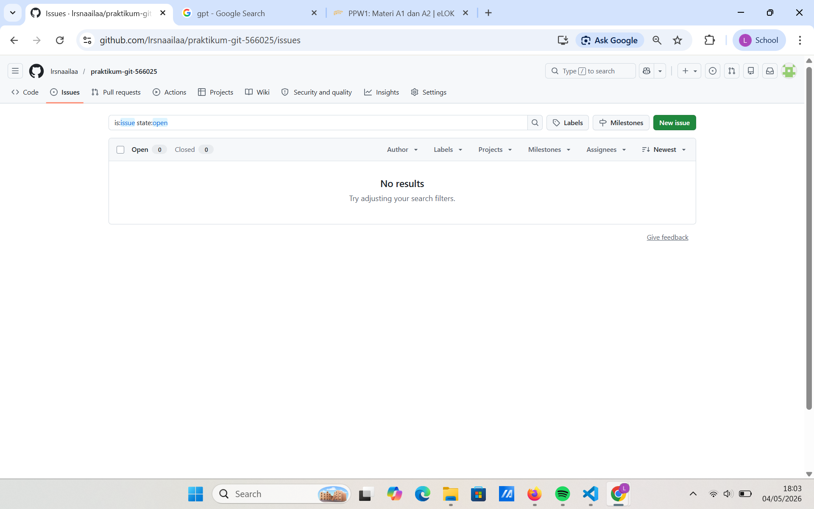

4. Masukkan judul (title) dan deskripsi (description) sesuai 5. kebutuhan.

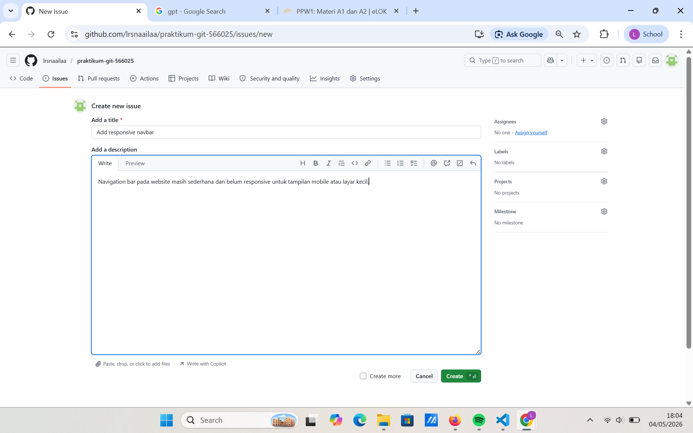

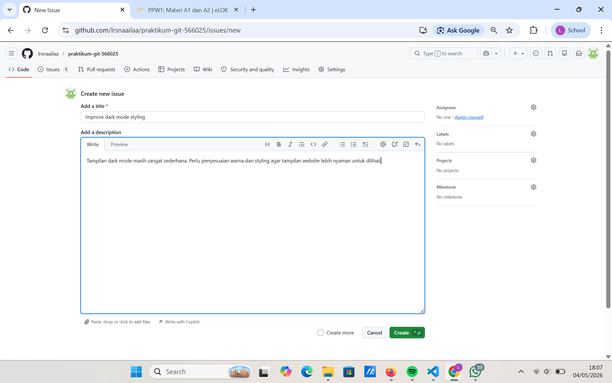

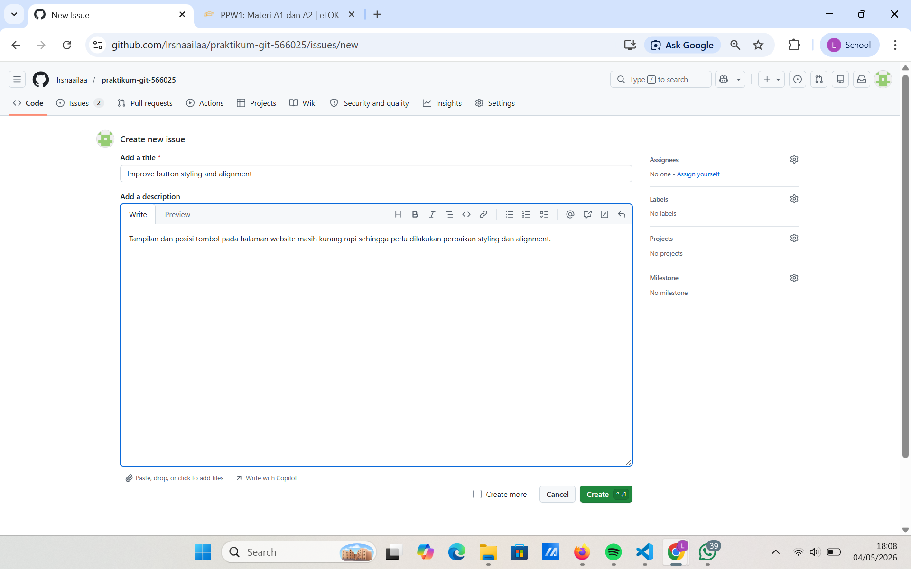

6. Klik Create Issue untuk menyimpan.

Apabila berhasil, issue yang telah dibuat akan muncul di dalam repositori GitHub seperti pada gambar dibawah ini:

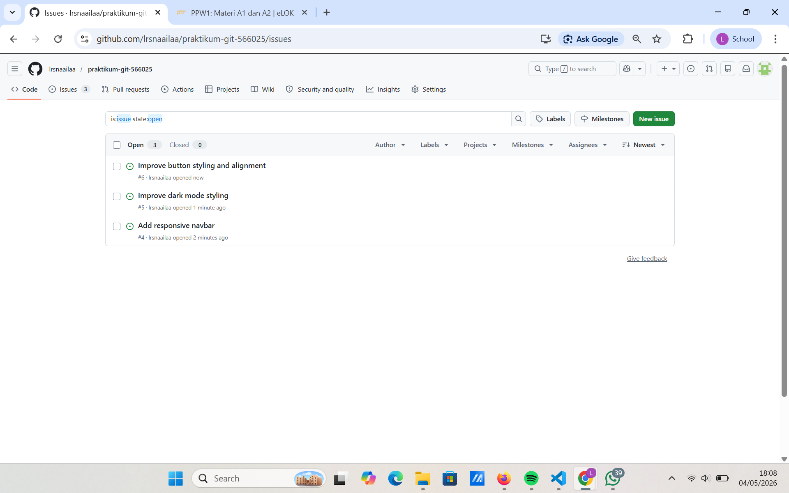

#### Membuat Pull Request 

##### Pull Request 1

- Perintah berikut dijalankan pada terminal untuk berpindah ke branch main dan membuat branch baru:

```bash
git checkout main
git checkout -b feature/responsive-navbar
```

Kemudian dilakukan pengeditan pada file index.html pada bagian navbar. Kode awalnya adalah

```html
<nav>
    <a href="#">Home</a> |
    <a href="#">About</a> |
    <a href="#">Contact</a>
</nav>
```

Diubah menjadi:

```html
<nav style="padding: 10px;">
    <a href="#" style="margin: 10px;">Home</a>
    <a href="#" style="margin: 10px;">About</a>
    <a href="#" style="margin: 10px;">Contact</a>
</nav>
```

- Perubahan ini bertujuan untuk membuat tampilan navbar menjadi lebih rapi dengan menambahkan jarak antar menu.
- Klik save, agar perubahan tersimpan.
- Kemudian proses commit dilakukan dengan menjalankan perintah berikut secara berurutan: 

```bash
git add .
git commit -m "feat: improve responsive navbar

Closes #4"
git push origin feature/responsive-navbar
```

- Buka repositori di GitHub, kemudian klik tombol Compare & Pull Request.

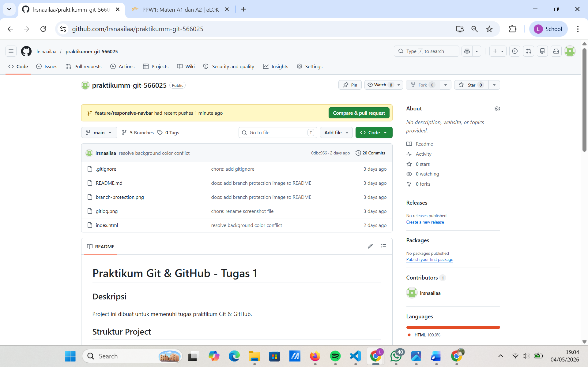

- Base branch diatur ke main dan compare branch ke feature/responsive-navbar.

- Mengisi title dan description sesuai dengan perubahan yang dilakukan.

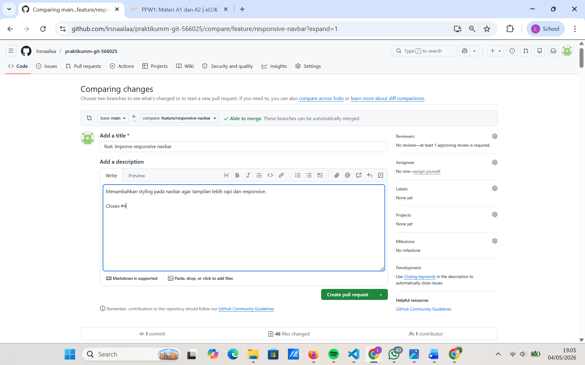

- Klik Bypass rules and merge (squash), kemudian pilih Confirm Bypass rules and merge (squash).

- Setelah proses merge selesai, branch dihapus dengan memilih Delete Branch.

##### Pull Request 2

- Perintah berikut dijalankan pada terminal untuk berpindah ke branch main dan membuat branch baru:

```bash
git checkout main
git checkout -b feature/darkmode-style
```

Kemudian dilakukan pengeditan pada file index.html pada bagian body dan diubah menjadi:

```html
body {
    background-color: #121212;
    color: white;
    text-align: center;
    font-family: Arial, sans-serif;
}
```

- Perubahan ini bertujuan untuk menerapkan tampilan dark mode menggunakan warna background gelap dan teks putih agar website lebih nyaman dilihat. Selain itu ditambahkan pengaturan font menggunakan Arial agar tampilan website terlihat lebih modern dan rapi.

kemudian dilakukan perubahan juga pada button dengan mengganti index.html menjadi:

```html
<button style="background-color: #333; color: white; padding: 10px; border-radius: 8px; border: none;">
```

- Perubahan ini bertujuan untuk menerapkan tampilan dark mode yang lebih modern dan tombolnya lebih bagus.

- Klik save, agar perubahan tersimpan.
- Kemudian proses commit dilakukan dengan menjalankan perintah berikut secara berurutan: 

```bash
git add .
git commit -m "style: improve dark mode styling

Closes #5"
git push origin feature/darkmode-style
```

- Buka repositori di GitHub, kemudian klik tombol Compare & Pull Request.

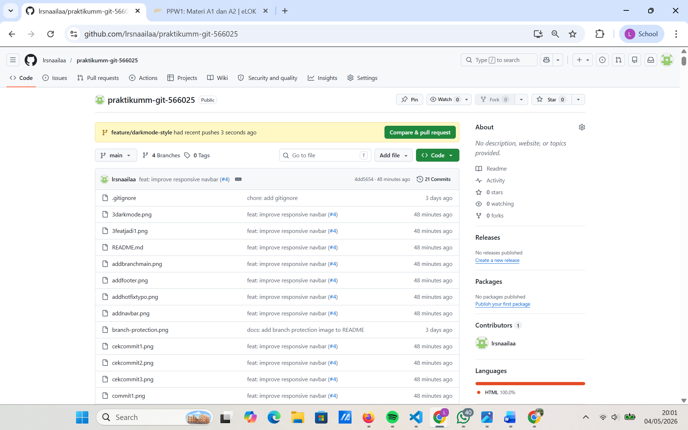

- Base branch diatur ke main dan compare branch ke feature/responsive-navbar.

- Mengisi title dan description sesuai dengan perubahan yang dilakukan.

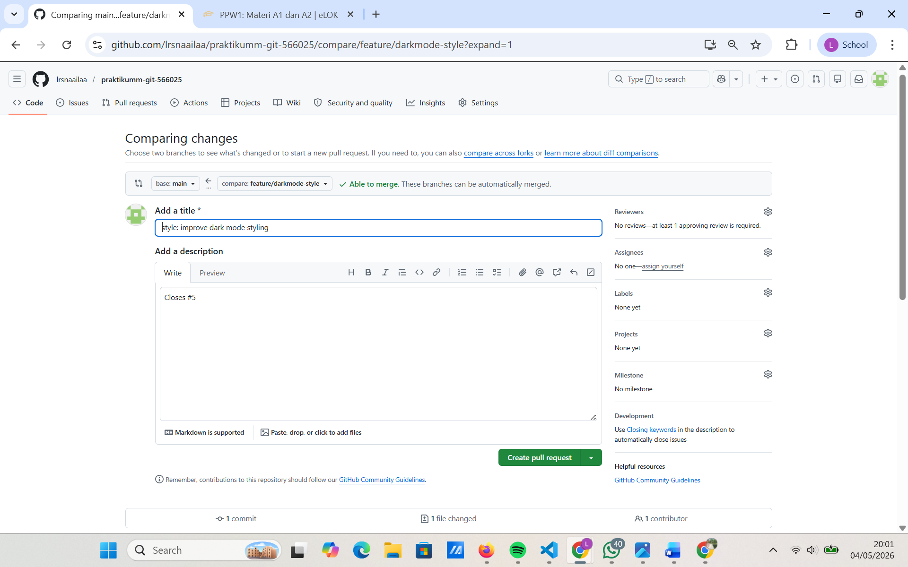

- Klik Bypass rules and merge (squash), kemudian pilih Confirm Bypass rules and merge (squash).

- Setelah proses merge selesai, branch dihapus dengan memilih Delete Branch.

##### Pull Request 3

- Perintah berikut dijalankan pada terminal untuk berpindah ke branch main dan membuat branch baru:

```bash
git checkout main
git pull origin main
git checkout -b fix/button-alignment
```

Kemudian dilakukan pengeditan pada file index.html pada bagian body dan diubah menjadi:

```html
<button style="margin-top: 10px; padding: 10px;">
    Klik Saya
</button>
```

- Perubahan ini bertujuan untuk Perubahan pada tombol dilakukan dengan menambahkan margin dan padding agar posisi tombol lebih rapi, memiliki jarak yang cukup dari elemen lain, serta meningkatkan kenyamanan tampilan pada halaman website.

- Klik save, agar perubahan tersimpan.
- Kemudian proses commit dilakukan dengan menjalankan perintah berikut secara berurutan: 

```bash
git add .
git commit -m "style: improve dark mode styling

Closes #5"
git push origin fix/button-alignment
```

- Buka repositori di GitHub, kemudian klik tombol Compare & Pull Request.


- Base branch diatur ke main dan compare branch ke feature/responsive-navbar.

- Mengisi title dan description sesuai dengan perubahan yang dilakukan.


- Klik Bypass rules and merge (squash), kemudian pilih Confirm Bypass rules and merge (squash).

- Setelah proses merge selesai, branch dihapus dengan memilih Delete Branch.

#### Add Colaborators

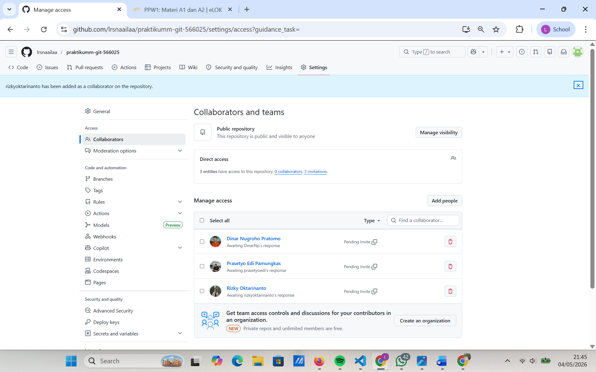

#### Membuat New Release

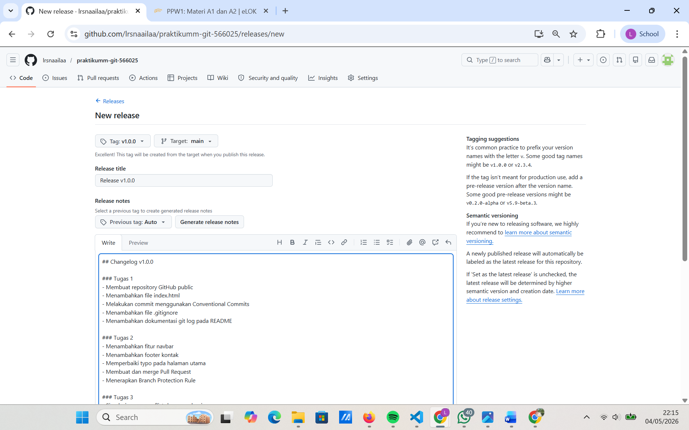
