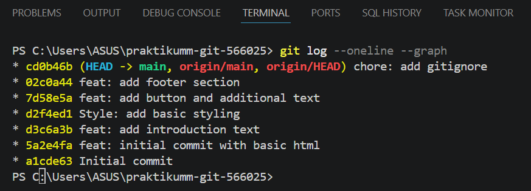

# Praktikum Git & GitHub - Tugas 1

## Deskripsi
Project ini dibuat untuk memenuhi tugas praktikum Git & GitHub.

## Struktur Project
- index.html → halaman web sederhana
- .gitignore → file untuk mengabaikan file tertentu
- README.md → dokumentasi project

## Dokumentasi

### 1. Membuat Repository
Repository dibuat di GitHub dan bersifat public.

### 2. Clone Repository
Dilakukan menggunakan perintah git clone.

### 3. Pembuatan File HTML
Membuat file index.html sebagai halaman sederhana.

### 4. Commit History
Melakukan beberapa commit menggunakan Conventional Commits:
- feat: initial commit
- initial commit with basic html
- feat: add introduction text
- style: add basic styling
- feat: add button and additional text
- feat: add footer section

### 5. Gitignore
File .gitignore digunakan untuk mengabaikan file tertentu.

## Git Log
